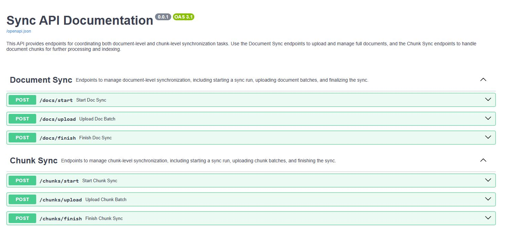

# Indexing Service (Proof of Concept)

Minimal FastAPI service for syncing documents and vectorstores with batch processing, leveraging LangChain's Record Manager.

## Endpoints

### Document Sync

- **POST** `/docs/start`
  Start sync
- **POST** `/docs/upload`
  Upload batch (requires `run_id` in the request)
- **POST** `/docs/finish`
  Finish sync (requires `run_id` in the request)

### Chunk Sync

- **POST** `/chunks/start`
  Start sync
- **POST** `/chunks/upload`
  Upload batch (requires `chunk_run_id` in the request)
- **POST** `/chunks/finish`
  Finish sync (requires `chunk_run_id` in the request)

## Running the Service

```bash
uv lock && uv sync
uv run python main.py
```

## Test Ingestion

```bash
uv run python ingest.py
```


